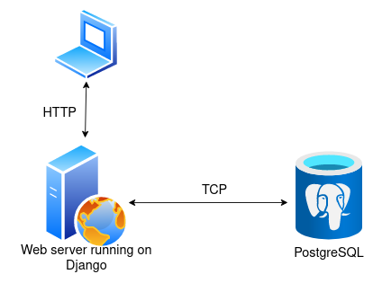

## Zone and Carrier management component

The project is a component of a delivery service backend. This component is responsible for managing order carriers and zones.

### Features
* create new zone (order address)
* create new carrier
* assign a carrier to a zone
* find carriers by zone coordinates

### How does the component work together with other components of a delivery service backend?
Imagine we have another component which is responsible for saving data about orders like amount, product article, customer details etc. 
Let's call the component "orders component".

**Step 1**

A request to create a new order comes from the UI to API Gateway. It contains shipping coordinates and details about 
the order. At this point, the orders component is called (using REST API or message queue) and it saves order details to the DB. 
After saving the order details, it calls our component (the one that manages zones and carriers) via REST API 
by submitting a request to create a zone.

**Step 2**

Zone management service saves new zone to the DB.

**Step 3**

The carrier in his application checks available orders (with delivery zones) and selects the most suitable zone for him. 
Orders are not assigned to carriers automatically, the courier takes any order he likes. At this moment, 
zone management service receives a request to save the new courier.

There can be several orders at once in the same zone (to the same address). 
This is why a request to receive couriers by coordinates may return a list.

### Stack
* Programming language - Python 3.9.1
* Web Framework - Django
* DB - PostgreSQL
* Deployment - Docker, docker-compose

High Level Design Diagram is attached below:

### Launching the project

1. Create a Postgres DB called "delivery_service_db" on your computer.
2. Run `python3 -m venv venv` to create a virtual environment.
3. Run `source venv/bin/activate` to activate a virtual environment.
4. Run `pip install -r requirements.txt` to install all necessary dependencies.
5. Run `python src/manage.py makemigrations delivery_service` to create migrations.
6. Run `python src/manage.py migrate` to apply the migrations.
7. Run `python src/manage.py runserver localhost:8000` to launch the server.

### Launching the project using Docker

The project can also be launched using Docker. It will create two containers: the app itself and a Postgres DB. 

1. Run `docker-compose up -d` to create and launch backend and DB containers.
2. Run `docker-compose exec backend python /code/manage.py makemigrations delivery_service` to create migrations.
3. Run `docker-compose exec backend python /code/manage.py migrate` to apply the migrations.

### API documentation
After launching the DEV server auto-generated API docs can be found at `/docs/` URL.

### Running automated tests

Simply execute `python src/manage.py test tests`.

**A more detailed documentation can be found in "docs" directory. 
It describes the DB schema, migrations and automated tests.** 
